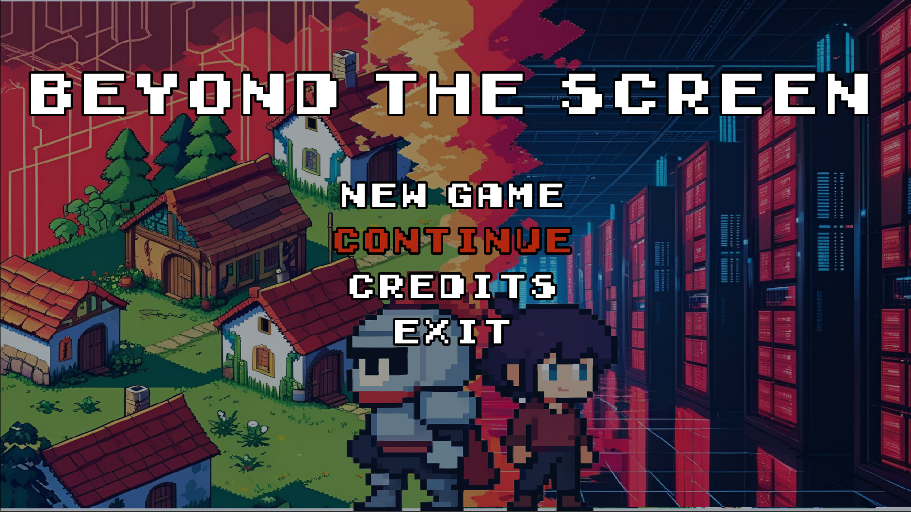
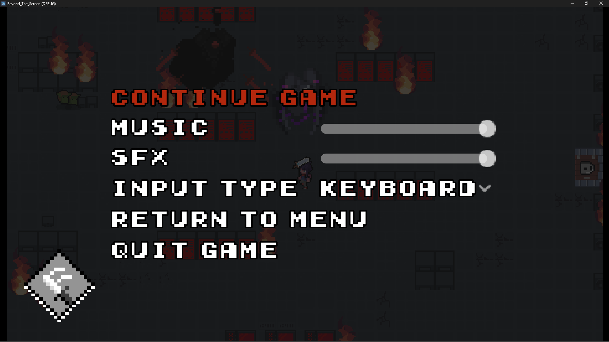
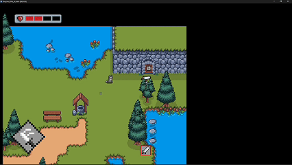
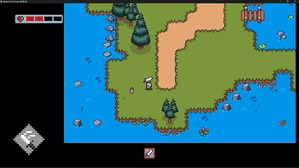
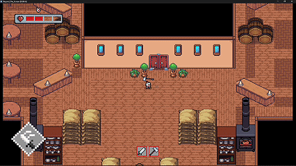
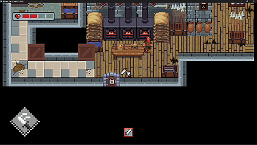
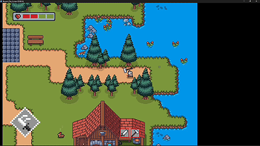
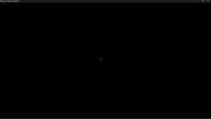
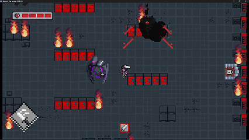

# Beyond_The_Screen

### MainScreen

### PauseScreen

## Fragmentos del juego

Algunos momentos destacados del juego. Se puede hacer click en el GIF para dirigirte al video.

### TownInteraction

### TakingPotionInTown
[]

### Restaurant

### blacksmithing

### Cavern

### CharacterTransition

### BossFight

## Recursos Usados

Este juego utiliza recursos de terceros con las siguientes licencias:

- **Sonido ambiental**: "A Grim Horror Atmosphere For Video Games And Movies" por Universfield  
  - Fuente: https://freesound.org/s/702863/  
  - Licencia: [Creative Commons Attribution 4.0](https://creativecommons.org/licenses/by/4.0/)  

Khiva Live Music in a Restaurant by selcukartut -- https://freesound.org/s/686050/ -- License: Creative Commons 0

Forging by adamcreeper -- https://freesound.org/s/780503/ -- License: Creative Commons 0

deep_under.wav by poots -- https://freesound.org/s/123093/ -- License: Attribution 4.0

Blade_Slice_Metal_01c by Artninja -- https://freesound.org/s/777075/ -- License: Attribution 4.0
